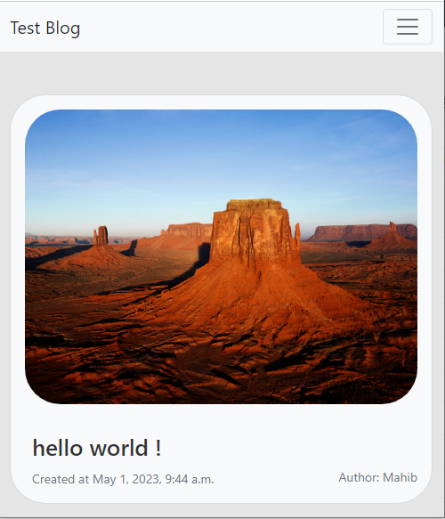
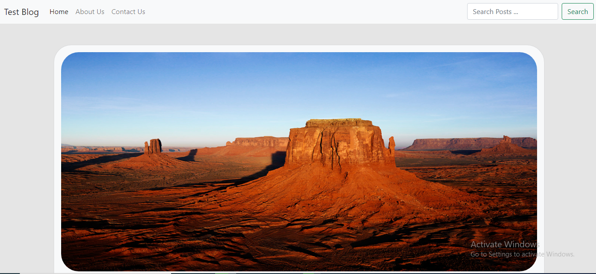

# BlogCMS-Django
`BlogCMS-Django` is a cms project and  it's allow to create a blog in django python. The cms allows you to create, edit and modify -> users, groups, posts, tags, media. You can add posts, users, tags and media. tags

## Assets Used
I used -
<li>Bootstrap 5</li>
<li>tinymce (for html genarator)</li>

## Requirnments
<li> Python (3.x) </li>
<li> Django (4.x) </li>

## Run
At first install django, tzdata, markdown by executing ```pip install django tzdata markdown```
<b>You can use virtualenv, see how to do it by <a href="https://www.geeksforgeeks.org/python-virtual-environment/" target="_blank">Click Here</a>

You can make migrations by executing ```python manage.py makemigrations``` and migrate by executing ```python manage.py migrate```

After setup, you can run server by executing ```python manage.py runserver```

## Blog Home-Page



## Contact Us
Under Constructing

## Features
<li>Add, Edit and delete posts</li>
<li>Easy to create users, edit users or delete users</li>
<li>Add, edit and delete media</li>
<li>Easy to add tags</li>
<li>Meta Descriptions for posts</li>
<li>If title is "Hello World", post url will be 'http://<your_url>/post/details/hello-world' For SEO</li>
<li>Fully responsive</li>
<li>Rich Text Editor for post content(You can copy html there)</li>


## Usage

You can view admin dashboard by going to url ```http://<your_url>/admin/```

Default Username: ```blogadmin``` && password: ```admin```

You can add profile after creating a new user.

You can create blog posts and content field supports html

You can copy html from richtexteditor by going to ```http://<your_url>/richtexteditor/```

You can upload media and get media url by following certain steps:

<li>First goto ```http://<your_url>/admin/app/media/``` and click on your media.</li>
<li> After that, find a text like ```media/*``` under ```Change media``` section and copy the text.</li>
<li>Thirdly, goto ```http://<your_url>/media/url/``` and paste the copied text and click the button</li>
<li>You can get link ```click here``` and copy the link.This is the lin for your media.</li>

## Issue
If you face any issue please create a issue on github. Soonly, a video available for guide.
